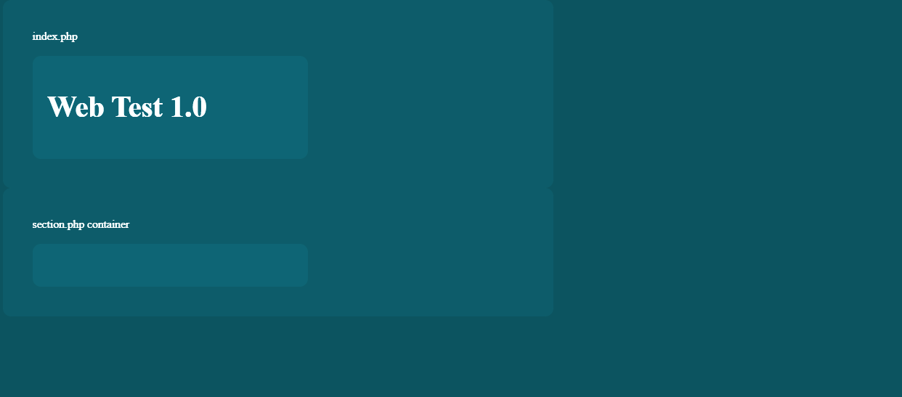

# October 4th, 2021 WebTest 1.0
###### created by Jose Jiménez

## General instructions:

The following test describes a series of small
programming exercises to measure your problem
solving capabilities and overall
coding proficiency.

The next criteria will be
taken into consideration for your final result.

Criteria | Description | Percentage
------------ | ------------- | ------------- 
Functionality | Your code do what is needed |50% 
Readability | Your code is easily readable | 20%
Simplicity | You provide simple solutions | 20%
Efficiency | Your code doesn't heavily compromise performance |10% 

### Project setup instructions
**1-** Download the project files into your
htdocs/root folder.

**2-** Open (localhost/rootFolder)/WebTest/index/index.php in your browser

**3-** You should see the following if not inform as soon as possible of the issue.

**4-** Create a file named section.php and place it in the same folder as index.php.

**5-** Create a file named logic.js and place it within assets/js folder.

**6-** Create a reference to logic.js in the script section of index.php.

Once you're finished with setup you have **180 minutes** to complete the following exercises: 

## Exercises

### 1- Javascript Warmup (20%)

- Create a simple **array** named **array1** with these 3 colors:

>"red", "blue","yellow"
  

- Create an **associative array** named **array2** and store
these 3 students:

  Nombre | Edad | Universidad
    ------------ | ------------- | ------------- 
  Pedro | 22 | UNA
  Maria | 29 | UCR
  Julio | 35 | TEC
  Karla | 19 | UCR
  
- Display both arrays using
  
<code> 
console.log(array1)
console.log(array2)
</code>

### 2- HTML Structure (20%)

- Create a text **input**
- Create a **button** below that input
- Create a **click event** in the previous button that changes its text to the following:
>"Excelente!"

You can use an inline function or call a function you defined in **logic.js**

### 3- MySQL Data retrieval (30%)
 Execute the **MySQL** code provided on **scripts/query.sql** on your own environment and do the following:
- Create a query to find out which student is the **oldest**.
- Create a query to find which students are from Universidad **"UCR"**.
- Create an **HTML table** in section.php and **populate** it with the second query result.
### 4- JQuery (30%)

- Create a **JQuery id selector** and select any of your previously created HTML elements (you can create one if you don't have any).
- Alter the value (or any other **visible property**) of the previously selected element using JQuery.
- Select the **row cells** of the **table** in the previous exercise (you can use a manually created table if you didn't generate the previous one) using a selector or a **JQuery traversing method**.
- Show your results with **console.log()**.

## Extra items (optional)

### 5- Styling (25 points)
- Give style to the **HTML visual elements** created previously using Bootstrap (provided in framework folder)
  or your own CSS file (place it in assets/css).

### 6- Local Storage (25 points)
- Store the **associative array** created in **item #1** in the browser **local storage**, load it back and show it using **console.log()**.

### 7-  AJAX (25 points)
- Using **axios.js** (provided in framework folder), **AJAX** or any other similar library/method fetch
data from <https://jsonplaceholder.typicode.com/todos/1> and show it using console.log().